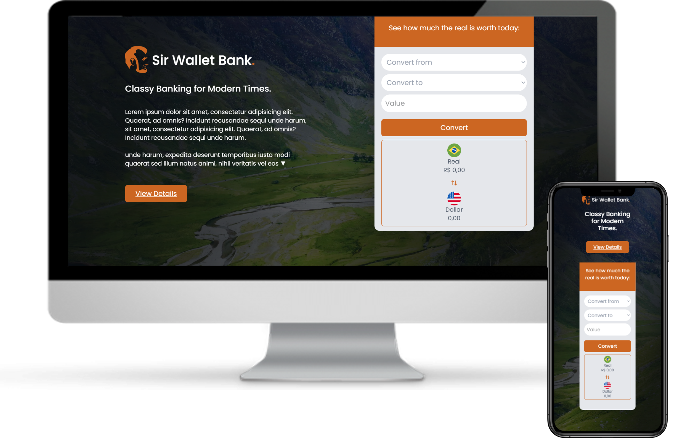

# Business Website
Projeto de landing page responsiva criado exclusivamente com HTML5, TailwindCSS e CSS3, priorizando estrutura semântica, design adaptável e código limpo.

## 💻 Demonstração

🔗 [Acesse aqui a versão online](https://flatvault.netlify.app/)

## ✨ Recursos

- HTML5
- CSS3
- TailwindCSS
- JavaScript
- Design responsivo
- Código limpo e organizado

## 📌 Observações

Este projeto foi desenvolvido com foco à atender negócios dos mais variados ramos, priorizando a aplicação de boas práticas em desenvolvimento front-end.

## 📬 Contato

- [GitHub Profile](https://github.com/VictorBonifac10) 
- [LinkedIn](https://www.linkedin.com/in/victor-alves-bonifacio/)
